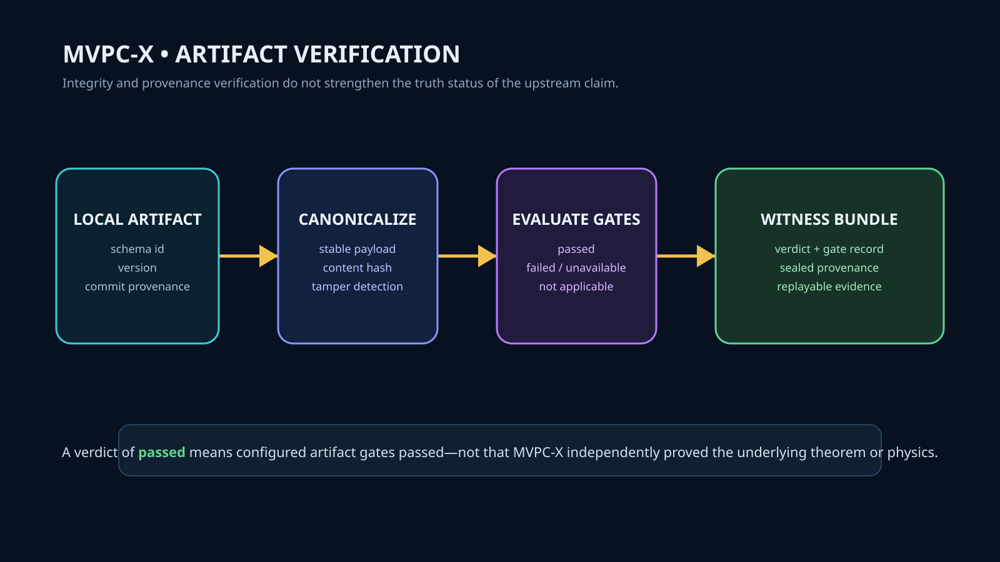

# MVPC-X

Claim-verification infrastructure. Turns claims into auditable evidence chains.



## System Role

MVPC-X operates as an independent external auditor across the Chyren constellation. It validates artifact integrity, computes canonical content hashes, evaluates declared validation gates, and issues tamper-evident witness bundles.

MVPC-X does **not** evaluate substantive truth:
- It does not verify the truth of physical hypotheses in Res-Nova.
- It does not replace Lean 4 compilation in 4Leibniz.
- It does not own or modify the RYTT token grammar.
- A verdict of `passed` certifies only that configured artifact gates and provenance checks succeeded fail-closed.

## Active Workstreams

- **On main**: fixture-backed adapters for 4Leibniz formal-claim catalogs and Res-Nova evidence ledgers, merged in #10. A missing native checker does not turn a theorem red. That case stays conditional, and a `sorry` stays rejected.
- **Not on main**: RYTT envelope replay. The branch for issue #7 fails its own tests, including a fixture path that points at a machine-local worktree, so it is closed rather than merged.

## Architecture

```
Artifact Ingest ──► Schema Check ──► Canonicalization ──► Gate Evaluation ──► Witness Bundle
 (JSON / Path)      (v1 Schemas)       (BLAKE3 Hash)       (Pass/Fail/Unavail)   (Signed Seal)
```

1. **Ingest**: Consumes local versioned artifacts without silent network fetching.
2. **Canonicalize**: Normalizes payload representation to produce deterministic hashes.
3. **Gates**: Evaluates provenance, required locators, and verification records. Missing or unparseable fields fail closed.
4. **Witness**: Packages gate results, verifier version, and input hash into a sealed, replayable bundle.

## Cross-Repository Contracts

- **4Leibniz**: Consumes `artifacts/v1/formal-claims.json`. Requires immutable commit SHA, module path, and Lean toolchain verification record for any `proved` claim.
- **Res-Nova**: Consumes `evidence/v1/claim-ledger.json`. Enforces status-specific evidence rules for `derived` and `empirically_supported` entries.
- **RYTT**: This repo does not fork the grammar. Envelope replay is not on main.

## Quick Start

```bash
# Run test suite
pytest

# Verify an artifact locally
python -m mvpc.cli verify artifact <path-to-artifact.json>
```

## Standards

- **Fail-closed**: Any unknown, skipped, or unparseable check is marked `unavailable` or `failed`, never `passed`.
- **Standalone**: No runtime dependency on upstream compiler toolchains.
- **No status inflation**: Upstream statuses (`conditional`, `proposal`, `open`, `refuted`) are preserved verbatim.

## How this was built

R.W. Yett directs the work. Much of the code and prose was written with AI coding assistants; those commits carry `Co-Authored-By` trailers. A `passed` verdict is a gate result from this repository. It is not a model judgment.
