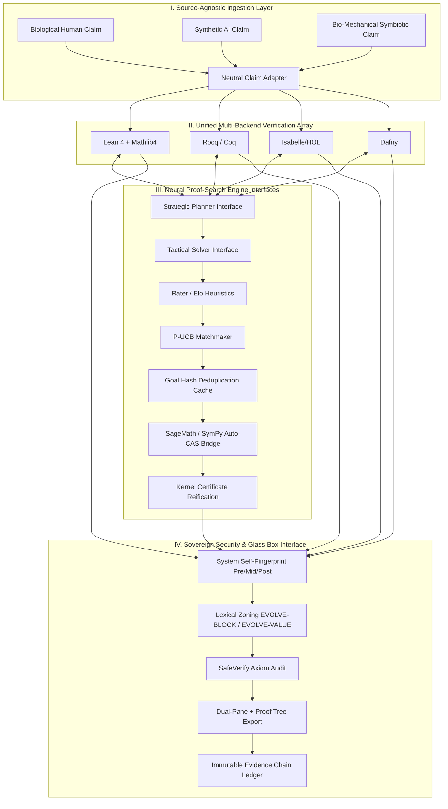

# MVPC-X Sovereign Nexus: Complete Architectural Specification Sheet

**Document Version:** `1.0.0-GOLD-SPEC`  
**Classification:** Sovereign Formal Engineering Specification  
**Genesis Date:** August 12, 2026  
**System Target Path:** `/home/mega/mvpc/` & `/home/mega/Documents/`  
**Core Operational Axiom:**  
$$\textbf{"AI proposes. Machines verify. Humans audit. Evidence persists."}$$

---

## 1. System Overview & Philosophical Foundation

The **MVPC-X Sovereign Nexus** is an open-source, multi-backend, bio-mechanical formal verification and proof-search engine. It establishes a clinically objective, over-engineered paradigm of computational verification with explicit trust boundaries.

### 1.1 The Proposer-Agnostic Paradigm (Neutral Intake Invariant)
The origin of a mathematical claim—whether formulated by a biological human, generated by an autoregressive neural network, or constructed through symbiotic human-AI collaboration—is completely irrelevant to its objective mechanical check. MVPC-X treats all incoming claims with identical, detached indifference, evaluating them strictly against the formal rules of trusted kernels.

### 1.2 The Bio-Mechanical Tripartite Loop
The system operates as a transparent, interactive tripartite loop:
1. **The Biological Agent (Human Auditor)**: Provides high-level strategic guidance, domain intuition, lemma decomposition, and final certificate verification.
2. **The Generative Agent (AI Engine)**: Handles autoformalization, natural language plan generation, tactic candidate search, and subgoal decomposition.
3. **The Mechanical Agent (Trusted Kernels)**: Computes weakest preconditions, type-checks ASTs, executes formal inference rules, and enforces system self-fingerprinting.

---

## 2. High-Level Architecture & System Flow

---

## 3. Module Specifications

### Module 1: Source-Agnostic Ingestion & Adapter Layer
See `src/mvpc/core/claim_adapter.py`.

### Module 2: Unified Multi-Backend Verification Array
Lean, Rocq/Coq, Isabelle (existing), Dafny scaffold (`backends/dafny.py`).

### Module 3: Neural Engine Interfaces
Planner/solver/Elo/P-UCB/goal-cache/CAS under `src/mvpc/brain/`.
External large models plug in via protocols; stubs never claim kernel success.

### Module 4: Sovereign Security & Anti-Tamper Core
Fingerprint, lexical zoning, SafeVerify under `src/mvpc/core/`.

### Module 5: Glass Box Interface & Evidence Persistence
UI exporters under `src/mvpc/ui/`; ledger under `src/mvpc/ledger.py`.

---

## 4. Trust Alignment

This gold spec is implemented under the trust foundation:
- 9-state verdict taxonomy (`trust_verdicts.py`)
- TCB declarations (`tcb.py`)
- Witness bundles (`witness_bundle.py`)
- Immutable failure records (`failure_record.py`)

**Principle:** MVPC-X produces reproducible, policy-bound verification records. It does not certify abstract truth outside a declared TCB.

---

## 5. Implementation Roadmap

* **Phase 1 (Core Integrity & Ingestion)**: claim_adapter, fingerprint, safe_verify, zoning, sandbox, ledger — **in tree**
* **Phase 2 (Multi-Backend Harness)**: Pantograph / SerAPI / Dafny-server deep integration
* **Phase 3 (Neural & CAS Engine)**: real provider plugins + Sage RPC
* **Phase 4 (Glass Box UI & Ledger)**: live dual-pane server + signed ledger anchors

See also: `docs/NEXUS_IMPLEMENTATION_STATUS.md`
